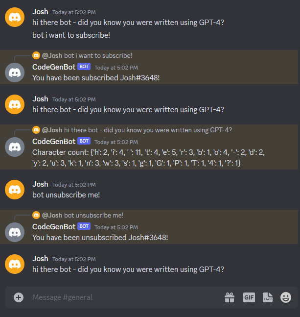
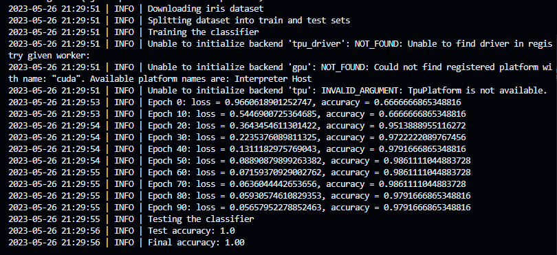
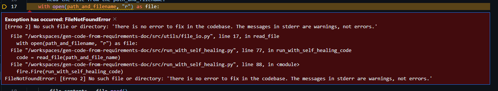

# gen-code-from-requirements-doc

## Purpose of this repo
This repo is meant to help me get a feel for how challenging it is to generate a useful codebase using GPT-4. I'm less concerned here with actually generating functional code and more focused on understanding to what degree this is possible.

## Design
Ideally I'd directly map from a requirements document to a functional codebase. Initial testing showed that was only going to work for very small projects (say, a single file or two containing a couple functions). Inspired by chain-of-thought prompting and how typical software development works, I tried introducing a middle step of a technical specification document. Really the purpose of the technical specification document is to:
1. Provide all the context that GPT-4 needs to generate one file at a time (due to context limitations), and
1. Serve as an intermediate step between the requirements document and the codebase that is faster for me to see issues in the requirements doc or prompts without digging through code.

## Usage
I've only tested this on Ubuntu 20.04 with Python 3.10.4.

High-level workflow:
- Human writes a requirements document and places it in `requirements_documents/<human_project_name>`.
- Human adds a configuration to `src/config.py` for the project.
- GPT-4 writes a technical specification document based on the requirements document to `generated_projects/<project_name_from_config_file>/technical_specification.md`:
    ```
    python src/generate_tech_spec_from_requirements.py --project_name <project_name>
    ```
- GPT-4 populates the content of the codebase: 
    ```
    python src/generate_code_from_tech_spec.py --project_name <project_name>
    ```
- Run the tests then run the code and use GPT-4 fix errors (note: this script calls `chmod +x` on the main bash script): 
    ```
    python src/run_code_with_self_healing.py --project_name <project_name>
    ```

Notes:
- During file generation, multiple requests are sent (an initial generation and then "improve file" requests).
- When running the code, it will take some iterations of "self healing" before it will work correctly (but this happens automatically).
- Code generation is done one file at a time. This is parallelized with joblib since the vast majority of the time is spent waiting for response from GPT-4.

## Experiments

To see more detail on each experiment, check out their requirements documents in `requirements_documents/`. Everything in `generated_projects/` was generated by GPT-4 without any manual edits (granted, I did a good amount of iterating on the requirements docs and prompts but never directly edited any of the generated files).

### Local Discord Character Counter Bot
As a first silly test - a discord bot that runs locally counts characters of messages sent by "subscribers" to it. See the requirements docs for usage.

While it's super simple, it's amazing it actually works!



Interesting thing that came up while making this work: I added the "Ensure that you have set `intents.message_content = True`" in the discord bot's requirements document to fix a bug that neither improve code or fix code finds so I just .. added it to the requirements but that doesn't seem like the right place for it.

### JAX-based Classifier for the IRIS Dataset
As a second test - although still super simple but much more in the direction of my eventual use case - using it to generate ML code. This was a fun example to see how it manages downloading data, splitting it into train/test, defining a model, training, and it.



Seems good. Granted I imagine there are _many_ examples of creating classifiers using the IRIS dataset on the internet so it's not all that shocking it did well. But still _super_ cool.

Interesting thing that came up while making this work: The first bot was designed to run forever so when I was first running the script for this experiment it (correctly) exited when it finished but `run_with_self_healing.py` (as it was at the time) interpreted the process ending as an error occurring. When it then sent stderr to GPT-4 (to "heal" itself), the code threw this error:



Really fun to see it look for a directory named "There is no error to fix in the codebase. The messages in stderr are warnings, not errors."

### GitHub Issues to PR Bot
As a third test - a bot which monitors a github repo for issues and automatically creates a PR linked to it.

Turns out after some "self healing" the bot would just hang when running the tests. While I could imagine implementing something like "if tests don't finish after X amount of time, break, and send that to GPT-4", I have mostly hit end of the effort I think is worthwhile to iron out all these cases. I think it's more fruitful to move on to the next iteration.

Just to get a feel of how close it got, I manually commented out the tests in `set_up_and_run.sh` and re-ran it but it seemed to get stuck in a loop of fixes that required fixing two files at once. Since only one file is fixed at a time, it just kept alternating over different files. Again, seems fixable but doesn't seem worth the effort to improve this approach/repo to handle this.

## Existing problems
- Generally passing around what folder is where is very fragile and needs some love.
- File generation (sometimes) generates a `.venv` folder, it does not "understand" this will be generated automatically during setup.
- How it returns the contents of files and how that context is parsed a bit fragile.
- Doesn't handle tests that hang and bug fixes that require changes to multiple files at once.

## Takeaways
- Generally this seems super promising. Check out the generated technical specification documents and code! Not bad. Definitely did better than I thought but we are _not_ quite there yet, at least going about it as this repo is structured.
- Specifying what I want in a requirements file and then using a technical specification document as an intermediate step was great. It seems like for the forseeable future a middle step (or two!) between "me writing what I want" and "generate code" that GPT-4 generates seems extremely helpful (both for human-interpretable debugging, producing higher quality code, and dealing with limited context lengths).
- There's definitely a need to be mindful about what the LLM needs to generate functional code and explicitly stating that that should appear in the technical specification document (e.g., environment variables, logging).
- Having the LLM iteratively reflect on its response and improve the response seemed to be super helpful. So helpful that this is just the default way  to send messages to GPT-4 (see `utils/llm.py`). A downside is generating a single document can turn into a half dozen requests.
- Generating code from a single forward pass is far too hard (e.g., req doc -> tech spec -> code). Getting the requirements doc + prompts right definitely took a couple dozen iterations. I think this needs to be an iterative process (with a human in the loop). And "iterating" by editing requirements and/or prompts and re-running makes it too hard to capture the changes and just generally slow going.
- Remembering the LLM is trained on all the data from the internet: beginner, intermediate, advanced, trash, power users, puzzles, etc. So instructing it to be an expert seemed to help. The same thing goes for package versions, it can sometimes use out-dated packages (even though it knows about newer versions) so telling it to use update-to-date packages.
- I like the mindset of viewing the LLM like it's a really book-smart intern with little real-world development experience. It has some unintuitive (to me) priors that can confusingly skew interpretations of vague instructions. When I felt the odd prior happening, it helped to just be more specific. At some point "more specific" means "examples".
- It's unclear how much also generating/running tests helped (but could be a lot). This repo just doesn't have the structure to make this easy to understand.

## Ideas for the next iteration
- Rather than this one-forward-pass-style, I think development may need to look a lot more like a standard software dev process (think: GitHub issue, branch, put in a PR, reviews, merge the PR, close the issue). I think this style of iterating will be much easier for me to give GPT-4 the specificity of feedback needed to build a codebase containing, say, a dozen+ files. This may also help limit what needs to be in GPT-4's context and allow me to build bigger codebases without having to put full requirements and/or technical specification documents in the context.
- Ideally in this new mode I'd only have to write issues and review PRs. It's mostly the same mindset as interacting with a junior engineer.
- This also may help surface to what degree tests help (since we'd see their results and the bot trying to fix them in the PR).
- I'd also like to add the ability for the LLM to "ask" for more detail if there are particular bits of the given instructions that are unclear. Issues/PRs also seem a great place for this back and forth. I had to do a lot of guess-and-check to determine if an instruction was "specific enough".
- Allowing for the use of tools such as search also may be important for using more up-to-date libraries.

## Related projects
These projects were extremely inspiring and I borrowed many ideas from them:
- [smol developer](https://github.com/smol-ai/developer)
- [Wolverine](https://github.com/biobootloader/wolverine)
- [Auto-GPT](https://github.com/Significant-Gravitas/Auto-GPT)
- [BabyAGI](https://github.com/yoheinakajima/babyagi)
