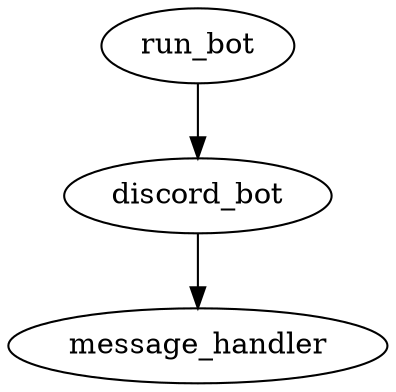

# Discord Character Counter Bot

## Table of Contents
- [Last Updated](#last-updated)
- [Overview](#overview)
- [Usage Instructions](#usage-instructions)
  - [Setup Instructions](#setup-instructions)
- [Deployment Instructions](#deployment-instructions)
- [Dependency Diagram](#dependency-diagram)
- [File Structure](#file-structure)
- [File Descriptions](#file-descriptions)

## Last Updated
2023-05-21

## Overview
The purpose of this discord bot is to allow users to send messages and have those messages characters counted by the bot and sent back to the user as a reply to their message.

## Usage Instructions

### Setup Instructions
1. Clone the repository
2. Create a virtual environment in the project root directory with `python -m venv .venv`
3. Activate the virtual environment with `source .venv/bin/activate`
4. Install the required packages with `pip install -r requirements.txt`
5. Run the bot with `python run_bot.py`

## Deployment Instructions
The bot will be deployed to Google Compute Engine using GitHub Actions. Every time a commit is merged into the repository, GitHub Actions will deploy the bot.

## Dependency Diagram


## File Structure
```
discord_character_counter/
├── .github/
│   └── workflows/
│       └── deploy.yaml
├── .venv/
├── src/
│   ├── discord_bot.py
│   ├── message_handler.py
│   └── run_bot.py
├── .gitignore
├── LICENSE
├── README.md
└── requirements.txt
```

## File Descriptions

### src/discord_bot.py
Handles the main functionality of the Discord bot, including subscribing and unsubscribing users, and listening for messages from subscribers.
- Third-party packages: discord.py
- `class DiscordBot`: Main class for the Discord bot
  - `async def on_ready(self)`: Logs when the bot is ready
  - `async def on_message(self, message)`: Handles incoming messages and replies with character count if the sender is a subscriber
  - `async def subscribe_user(self, user)`: Subscribes a user and sends a confirmation message
  - `async def unsubscribe_user(self, user)`: Unsubscribes a user and sends a confirmation message

### src/message_handler.py
Contains the logic for counting characters in a message.
- `def count_characters(message: str) -> Dict[str, int]`: Counts the characters in a message and returns a dictionary mapping characters to their counts

### src/run_bot.py
Entry point for running the Discord bot.
- Third-party packages: discord.py
- `def main()`: Initializes and runs the Discord bot

### .github/workflows/deploy.yaml
GitHub Actions workflow for deploying the bot to Google Compute Engine.

### .gitignore
Specifies files and directories to be ignored by Git.

### LICENSE
Contains the license for the project.

### README.md
Provides an overview of the project and instructions for setup and usage.

### requirements.txt
Lists the required Python packages for the project.