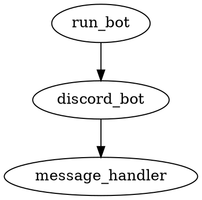

# Discord Bot Deployed to Google Compute Engine Design Document

## Table of Contents
- [Last Updated](#last-updated)
- [Overview](#overview)
- [Usage Instructions](#usage-instructions)
  - [Setup Instructions](#setup-instructions)
- [Deployment Instructions](#deployment-instructions)
- [Dependency Diagram](#dependency-diagram)
- [File Structure](#file-structure)
- [File Descriptions](#file-descriptions)

## Last Updated
2023-05-21

## Overview
The purpose of this project is to create a Discord bot that allows users to send messages and have those messages characters counted by the bot and sent back to the user as a reply to their message.

## Usage Instructions

### Setup Instructions
1. Clone the repository
2. Create a virtual environment in the project root directory with `python -m venv .venv`
3. Activate the virtual environment with `source .venv/bin/activate`
4. Install the required packages with `pip install -r requirements.txt`
5. Run the bot with `python run_bot.py`

## Deployment Instructions
The bot will be deployed to Google Compute Engine using GitHub Actions each time a commit is merged into the repository.

## Dependency Diagram


## File Structure
```
gce_discord_bot/
├── .github/
│   └── workflows/
│       └── deploy.yaml
├── src/
│   ├── discord_bot.py
│   ├── message_handler.py
│   └── run_bot.py
├── .gitignore
├── LICENSE
├── README.md
├── requirements.txt
└── project_design_document.md
```

## File Descriptions

### .github/workflows/deploy.yaml
GitHub Actions workflow file for deploying the bot to Google Compute Engine.

### src/discord_bot.py
Contains the DiscordBot class which handles connecting to Discord and listening for messages.
- Third-party packages: discord.py
- DiscordBot class
  - Description: Class for connecting to Discord and listening for messages.
  - Methods:
    - on_ready: Logs when the bot is connected and ready.
    - on_message: Handles incoming messages and replies with character count.

### src/message_handler.py
Contains the MessageHandler class which processes messages and manages subscribers.
- MessageHandler class
  - Description: Class for processing messages and managing subscribers.
  - Methods:
    - subscribe_user: Adds a user to the subscribers list.
    - unsubscribe_user: Removes a user from the subscribers list.
    - process_message: Processes a message and returns a character count dictionary.

### src/run_bot.py
Main script to run the Discord bot.
- Third-party packages: discord.py
- Functions:
  - main: Initializes the DiscordBot and runs it.

### .gitignore
Specifies files and directories to be ignored by Git.

### LICENSE
Contains the license for the project.

### README.md
Provides an overview of the project, setup, and usage instructions.

### requirements.txt
Lists the required Python packages for the project.