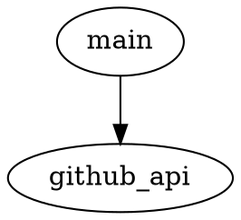

# GitHub Issues to PR Bot

## Overview

The purpose of this project is to create a bot that monitors a GitHub repository for new issues and automatically creates a pull request for each issue. The bot will also close the issue when the pull request is merged.

## Setup and Usage Instructions

1. Clone the repository.
2. Install the required packages using `pip install -r requirements.txt`.
3. Set the environment variable `TOKEN_FOR_GITHUB` to your GitHub token.
4. Run the bot using `<project_root>/set_up_and_run_bot.sh`.

## Dependency Diagram



## File Structure

```
github_issues_to_pr_bot/
├── .gitignore
├── LICENSE
├── readme.md
├── requirements.txt
├── set_up_and_run_bot.sh
└── src
    ├── github_api.py
    └── main.py
```

## Logging

The built-in `logging` module will be used with module-level loggers formatted as `YYYY-MM-DD HH:MM:SS | LEVEL | MESSAGE` where the datetime is in UTC. Log all new occurrences of issues and actions taken by the bot at the `INFO` level.