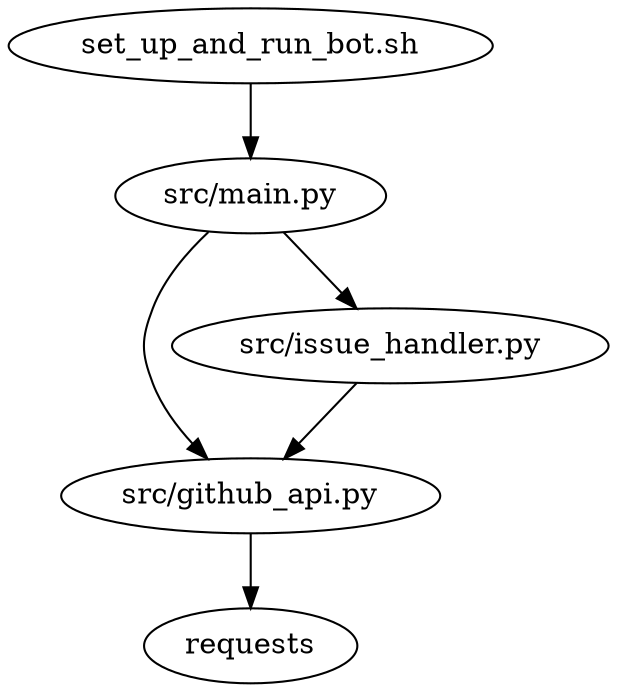

# Project Design Document

## Table of Contents
- [Last Updated](#last-updated)
- [Overview](#overview)
- [Setup and Usage](#setup-and-usage)
- [Dependency Diagram](#dependency-diagram)
- [File Structure](#file-structure)
- [Logging](#logging)
- [File Descriptions](#file-descriptions)

## Last Updated
2023-05-25

## Overview
The purpose of this project is to create a GitHub bot that monitors a repository for new issues and automatically creates a pull request for each issue. The bot will also close the issue when the pull request is merged.

## Setup and Usage
1. Clone the repository
2. Set the environment variable `TOKEN_FOR_GITHUB` to your GitHub token
3. Run `<project_root>/set_up_and_run_bot.sh` to set up the virtual environment, install required packages, run tests, and start the bot

## Dependency Diagram


## File Structure
```
generated_projects/github_issues_to_pr_bot
├── .venv
├── LICENSE
├── project_design_document.md
├── readme.md
├── requirements.txt
├── set_up_and_run_bot.sh
├── src
│   ├── __init__.py
│   ├── github_api.py
│   └── main.py
│   └── issue_handler.py
└── tests
    ├── __init__.py
    ├── test_github_api.py
    └── test_issue_handler.py
```

## Logging
The built-in `logging` module will be used with module-level loggers formatted as `YYYY-MM-DD HH:MM:SS | LEVEL | MESSAGE` where the datetime is in UTC. Log all new occurrences of issues and actions taken by the bot at the `INFO` level.

## File Descriptions

### set_up_and_run_bot.sh
This bash script sets up the virtual environment, installs required packages, runs tests, and starts the bot.
- Environment Variables:
  - TOKEN_FOR_GITHUB

### src/main.py
The main entry point for the bot. It initializes the bot and runs it indefinitely.
- Functions:
  - def main() -> None:
    - Description: The main function that initializes and runs the bot.
- Environment Variables:
  - TOKEN_FOR_GITHUB

### src/github_api.py
This module contains functions for interacting with the GitHub API.
- Third-party packages:
  - requests
- Functions:
  - def get_issues(repo: str, token: str) -> List[Dict[str, Any]]:
    - Description: Retrieves a list of open issues from the specified repository.
    - Example: get_issues("Josh-Joseph/github-actions-bot-test", "your_token") -> [{"id": 1, "title": "Issue 1", ...}, ...]
  - def create_pull_request(repo: str, issue: Dict[str, Any], token: str) -> Dict[str, Any]:
    - Description: Creates a pull request for the specified issue in the repository.
    - Example: create_pull_request("Josh-Joseph/github-actions-bot-test", {"id": 1, "title": "Issue 1", ...}, "your_token") -> {"id": 1, "title": "Issue 1", ...}
  - def close_issue(repo: str, issue_id: int, token: str) -> None:
    - Description: Closes the specified issue in the repository.
- Environment Variables:
  - TOKEN_FOR_GITHUB

### src/issue_handler.py
This module contains the IssueHandler class that handles issue processing and pull request creation.
- Classes:
  - class IssueHandler:
    - Description: A class that handles issue processing and pull request creation.
    - Methods:
      - def __init__(self, repo: str, token: str) -> None:
        - Description: Initializes the IssueHandler with the specified repository and token.
      - def process_issues(self) -> None:
        - Description: Processes open issues and creates pull requests for them.
- Environment Variables:
  - TOKEN_FOR_GITHUB

### tests/test_github_api.py
This file contains tests for the `github_api.py` module.

### tests/test_issue_handler.py
This file contains tests for the `issue_handler.py` module.