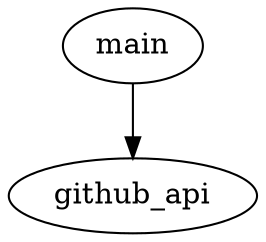

# GitHub Issues to PR Bot Design Document

- [Table of Contents](#table-of-contents)
- [Last Updated](#last-updated)
- [Overview](#overview)
- [Setup and Usage Instructions](#setup-and-usage-instructions)
- [Dependency Diagram](#dependency-diagram)
- [File Structure](#file-structure)
- [Logging](#logging)
- [File Descriptions](#file-descriptions)
  - [set_up_and_run_bot.sh](#set_up_and_run_botsh)
  - [src/main.py](#srcmainpy)
  - [src/github_api.py](#srcgithub_apipy)
  - [requirements.txt](#requirementstxt)
  - [readme.md](#readmemd)
  - [LICENSE](#license)

## Table of Contents

See above.

## Last Updated

2023-05-24

## Overview

The purpose of this project is to create a bot that monitors a GitHub repository for new issues and automatically creates a pull request for each issue. The bot will also close the issue when the pull request is merged.

## Setup and Usage Instructions

1. Clone the repository.
2. Install the required packages using `pip install -r requirements.txt`.
3. Set the environment variable `TOKEN_FOR_GITHUB` to your GitHub token.
4. Run the bot using `<project_root>/set_up_and_run_bot.sh`.

## Dependency Diagram



## File Structure

```
github_issues_to_pr_bot/
├── .gitignore
├── LICENSE
├── readme.md
├── requirements.txt
├── set_up_and_run_bot.sh
└── src
    ├── github_api.py
    └── main.py
```

## Logging

The built-in `logging` module will be used with module-level loggers formatted as `YYYY-MM-DD HH:MM:SS | LEVEL | MESSAGE` where the datetime is in UTC. Log all new occurrences of issues and actions taken by the bot at the `INFO` level.

## File Descriptions

### set_up_and_run_bot.sh

A shell script to set up and run the bot.

- No third-party Python packages.
- No environment variables.

### src/main.py

The main entry point for the bot.

- Third-party Python packages: `requests`
- Environment variables: `TOKEN_FOR_GITHUB`

- `def main() -> None:`
  - Description: The main function that runs the bot.
  - Example input-output pair: N/A

### src/github_api.py

A module containing functions to interact with the GitHub API.

- Third-party Python packages: `requests`
- Environment variables: `TOKEN_FOR_GITHUB`

- `def get_open_issues(repo: str) -> List[Dict[str, Any]]:`
  - Description: Retrieves a list of open issues for the given repository.
  - Example input-output pair: `get_open_issues("Josh-Joseph/github-actions-bot-test") -> [{"id": 1, "title": "Issue 1", ...}, ...]`

- `def create_pull_request(repo: str, issue: Dict[str, Any]) -> Dict[str, Any]:`
  - Description: Creates a pull request for the given issue in the specified repository.
  - Example input-output pair: `create_pull_request("Josh-Joseph/github-actions-bot-test", {"id": 1, "title": "Issue 1", ...}) -> {"id": 2, "title": "Issue 1", ...}`

- `def close_issue(repo: str, issue_id: int) -> None:`
  - Description: Closes the issue with the given ID in the specified repository.
  - Example input-output pair: N/A

- `def add_comment_to_issue(repo: str, issue_id: int, comment: str) -> None:`
  - Description: Adds a comment to the issue with the given ID in the specified repository.
  - Example input-output pair: N/A

### requirements.txt

A file containing the required Python packages for the project.

- No third-party Python packages.
- No environment variables.

### readme.md

A file containing instructions on how to set up and run the bot.

- No third-party Python packages.
- No environment variables.

### LICENSE

A file containing the license for the project.

- No third-party Python packages.
- No environment variables.