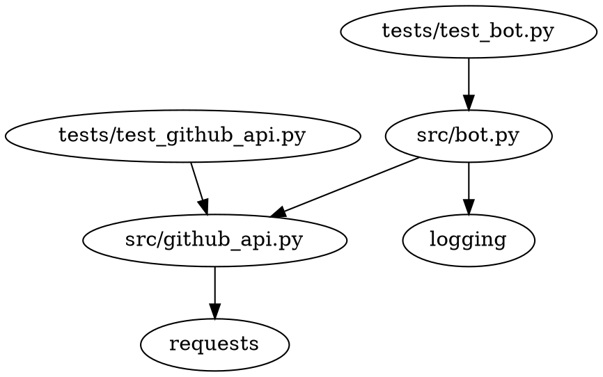

# Project Design Document

## Table of Contents

1. [Last Updated](#last-updated)
2. [Overview](#overview)
3. [Setup and Usage](#setup-and-usage)
4. [Code Organization](#code-organization)
5. [Dependency Diagram](#dependency-diagram)
6. [Logging](#logging)
7. [Individual File Contents](#individual-file-contents)

## Last Updated

2023-05-26

## Overview

The objective of this project is to create a GitHub Issues to PR Bot that monitors a GitHub repository for new issues and automatically creates a pull request for each issue. The bot will also close the issue when the pull request is merged.

## Setup and Usage

The codebase's root folder is `generated_projects/github_issues_to_pr_bot`. All commands will be run from this location.

To set up and run the bot, execute the following script:

```bash
./set_up_and_run_bot.sh
```

## Code Organization

```
generated_projects/github_issues_to_pr_bot
├── src
│   ├── __init__.py
│   ├── bot.py
│   └── github_api.py
├── tests
│   ├── test_bot.py
│   └── test_github_api.py
├── set_up_and_run_bot.sh
├── requirements.txt
├── readme.md
├── project_design_document.md
└── LICENSE
```

## Dependency Diagram



## Logging

The built-in `logging` module will be used with module-level loggers formatted as `YYYY-MM-DD HH:MM:SS | LEVEL | MESSAGE` where the datetime is in UTC. Log all new occurrences of issues and actions taken by the bot at the `INFO` level.

## Individual File Contents

### src/bot.py

This file contains the main logic for the GitHub Issues to PR Bot.

- `class GitHubIssuesToPRBot:`
    - `def __init__(self, github_api: GitHubAPI, repo: str, polling_interval: int = 10) -> None:`
        - Initializes the bot with a GitHubAPI instance, the repository to monitor, and the polling interval.
    - `def run(self) -> None:`
        - Runs the bot indefinitely, checking for new issues and creating pull requests for them.

- `def main() -> None:`
    - Sets up the logger, reads the GitHub token from the environment variable `TOKEN_FOR_GITHUB`, initializes the bot, and runs it.
    - Third-party Python packages used: None
    - Environment variables used: `TOKEN_FOR_GITHUB`

### src/github_api.py

This file contains the GitHubAPI class that interacts with the GitHub API.

- `class GitHubAPI:`
    - `def __init__(self, token: str) -> None:`
        - Initializes the GitHubAPI instance with the provided token.
    - `def get_open_issues(self, repo: str) -> List[Dict[str, Any]]:`
        - Retrieves a list of open issues for the specified repository.
        - Example input-output pair: `("Josh-Joseph/github-actions-bot-test") -> [{"number": 1, "title": "Issue 1", "body": "Issue 1 description"}]`
    - `def create_pull_request(self, repo: str, issue: Dict[str, Any]) -> Dict[str, Any]:`
        - Creates a pull request for the given issue in the specified repository.
        - Example input-output pair: `("Josh-Joseph/github-actions-bot-test", {"number": 1, "title": "Issue 1", "body": "Issue 1 description"}) -> {"number": 2, "title": "Issue 1", "body": "Issue 1 description\n\nCloses #1"}`
    - `def close_issue(self, repo: str, issue_number: int) -> None:`
        - Closes the issue with the given issue number in the specified repository.
        - Example input-output pair: `("Josh-Joseph/github-actions-bot-test", 1) -> None`
    - `def add_issue_comment(self, repo: str, issue_number: int, comment: str) -> None:`
        - Adds a comment to the issue with the given issue number in the specified repository.
        - Example input-output pair: `("Josh-Joseph/github-actions-bot-test", 1, "This issue has been resolved by PR #2.") -> None`
    - Third-party Python packages used: `requests`
    - Environment variables used: None

### tests/test_bot.py

This file contains tests for the `src/bot.py` file.

- `def test_github_issues_to_pr_bot_initialization():`
    - Tests the initialization of the GitHubIssuesToPRBot class.
- `def test_github_issues_to_pr_bot_run():`
    - Tests the `run` method of the GitHubIssuesToPRBot class.
- Third-party Python packages used: None
- Environment variables used: None

### tests/test_github_api.py

This file contains tests for the `src/github_api.py` file.

- `def test_github_api_initialization():`
    - Tests the initialization of the GitHubAPI class.
- `def test_get_open_issues():`
    - Tests the `get_open_issues` method of the GitHubAPI class.
- `def test_create_pull_request():`
    - Tests the `create_pull_request` method of the GitHubAPI class.
- `def test_close_issue():`
    - Tests the `close_issue` method of the GitHubAPI class.
- `def test_add_issue_comment():`
    - Tests the `add_issue_comment` method of the GitHubAPI class.
- Third-party Python packages used: None
- Environment variables used: None

### set_up_and_run_bot.sh

This bash script sets up the virtual environment, installs the required packages, runs the tests, and starts the bot.

### requirements.txt

This file lists the required Python packages for the project.

### readme.md

This file contains an overview of the project, setup and usage instructions, and a link to the project design document.

### project_design_document.md

This file contains the project design document.

### LICENSE

This file contains the MIT license for the project.
