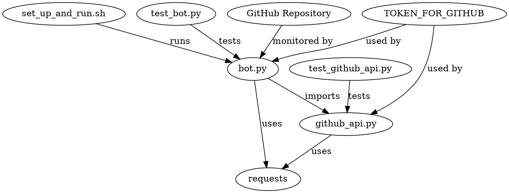

# Technical Specification: GitHub Issues to PR Bot

- Table of Contents
  - [Last Updated](#last-updated)
  - [Objectives](#objectives)
  - [Setup and Usage Instructions](#setup-and-usage-instructions)
  - [High-Level Overview](#high-level-overview)
  - [Code Organization](#code-organization)
  - [Dependency Diagram](#dependency-diagram)
  - [Logging](#logging)
  - [Individual File Contents](#individual-file-contents)

## Last Updated

2023-05-26

## Objectives

The objective of this project is to create a GitHub bot that monitors a specific repository for new issues and automatically creates a pull request for each issue. The bot will also close the issue when the pull request is merged. The bot should run indefinitely and check for changes every 10 seconds.

## Setup and Usage Instructions

1. Clone the repository to your local machine.
2. Navigate to the root folder of the codebase (`generated_projects/github_issues_to_pr_bot`).
3. Run the bash script `set_up_and_run.sh` to set up the virtual environment, install the required packages, run the tests, and start the bot.

## High-Level Overview

The codebase is organized into a `src` module containing the main functionality of the bot and a `tests` directory containing test files for each Python file in the `src` module. The bot is run by a bash script `set_up_and_run.sh` that sets up the virtual environment, installs the required packages, runs the tests, and starts the bot.

The bot achieves its objectives by:

1. Monitoring the GitHub repository `Josh-Joseph/github-actions-bot-test` for new issues.
2. Creating a new branch with the issue number as the branch name when a new issue is created.
3. Creating a pull request from the new branch to the main branch with the issue's title as the pull request's title, the issue's body as the pull request's body, and a link to the issue.
4. Closing the issue when the pull request is merged.
5. Running indefinitely and checking for changes every 10 seconds.

## Code Organization

```
generated_projects/github_issues_to_pr_bot
├── src
│   ├── __init__.py
│   ├── bot.py
│   └── github_api.py
├── tests
│   ├── test_bot.py
│   └── test_github_api.py
├── set_up_and_run.sh
├── requirements.txt
├── readme.md
└── LICENSE
```

## Dependency Diagram



## Logging

The built-in `logging` module will be used with module-level loggers formatted as `YYYY-MM-DD HH:MM:SS | LEVEL | MESSAGE` where the datetime is in UTC. Log all new occurrences of issues and actions taken by the bot at the `INFO` level.

## Individual File Contents

### set_up_and_run.sh

This bash script sets up the virtual environment, installs the required packages, runs the tests, and starts the bot.

### bot.py

Main entry point for the GitHub Issues to PR Bot.

- Logging configuration: Module-level logger with the format `YYYY-MM-DD HH:MM:SS | LEVEL | MESSAGE`.

- `def main() -> None:`
  - Description: The main function that initializes the bot and starts monitoring the GitHub repository for new issues.
  - Example input-output pair: N/A
  - Third-party Python packages: requests
  - Environment variables: TOKEN_FOR_GITHUB

- `def monitor_repository() -> None:`
  - Description: Monitors the GitHub repository for new issues and takes appropriate actions.
  - Example input-output pair: N/A
  - Third-party Python packages: requests
  - Environment variables: TOKEN_FOR_GITHUB

### github_api.py

Contains the GitHub API wrapper class and related functions.

- Logging configuration: Module-level logger with the format `YYYY-MM-DD HH:MM:SS | LEVEL | MESSAGE`.

- `class GitHubAPI:`
  - Description: A class that wraps the GitHub API and provides methods for interacting with the API.
  - Third-party Python packages: requests
  - Environment variables: TOKEN_FOR_GITHUB

  - `def __init__(self, token: str) -> None:`
    - Description: Initializes the GitHubAPI class with the provided token.
    - Example input-output pair: N/A

  - `def create_branch(self, issue_number: int) -> None:`
    - Description: Creates a new branch with the issue number as the branch name.
    - Example input-output pair: N/A

  - `def create_pull_request(self, issue_number: int, issue_title: str, issue_body: str) -> None:`
    - Description: Creates a pull request from the new branch to the main branch with the issue's title as the pull request's title, the issue's body as the pull request's body, and a link to the issue.
    - Example input-output pair: N/A

  - `def close_issue(self, issue_number: int) -> None:`
    - Description: Closes the issue with the provided issue number.
    - Example input-output pair: N/A

  - `def get_new_issues(self) -> List[Dict[str, Any]]:`
    - Description: Retrieves a list of new issues from the GitHub repository.
    - Example input-output pair: N/A

  - `def merge_pull_request(self, pull_request_number: int) -> None:`
    - Description: Merges the pull request with the provided pull request number.
    - Example input-output pair: N/A

### test_bot.py

Contains tests for the `bot.py` file.

- `def test_main():`
  - Description: Tests the `main` function in `bot.py`.

- `def test_monitor_repository():`
  - Description: Tests the `monitor_repository` function in `bot.py`.

### test_github_api.py

Contains tests for the `github_api.py` file.

- `def test_create_branch():`
  - Description: Tests the `create_branch` method in the `GitHubAPI` class.

- `def test_create_pull_request():`
  - Description: Tests the `create_pull_request` method in the `GitHubAPI` class.

- `def test_close_issue():`
  - Description: Tests the `close_issue` method in the `GitHubAPI` class.

- `def test_get_new_issues():`
  - Description: Tests the `get_new_issues` method in the `GitHubAPI` class.

- `def test_merge_pull_request():`
  - Description: Tests the `merge_pull_request` method in the `GitHubAPI` class.

### requirements.txt

Contains the list of required Python packages for the project.

### readme.md

Contains the project's documentation, including setup and usage instructions.

### LICENSE

Contains the MIT license for the project.
