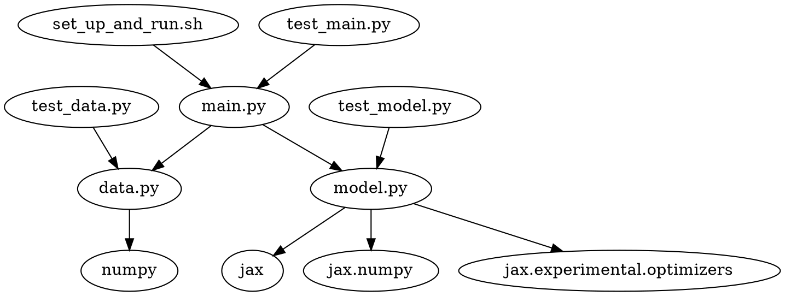

# JAX IRIS Classifier Technical Specification

## Table of Contents
1. [Last Updated](#last-updated)
2. [Objectives](#objectives)
3. [Setup and Usage Instructions](#setup-and-usage-instructions)
4. [High-level Overview](#high-level-overview)
5. [Code Organization](#code-organization)
6. [Dependency Diagram](#dependency-diagram)
7. [Logging](#logging)
8. [Individual File Contents](#individual-file-contents)

## Last Updated
2023-05-26

## Objectives
The objective of this project is to train and test a feed-forward neural network classifier built using JAX on the iris dataset. The classifier must be run as a bash script that sets up a virtual environment, installs necessary requirements, downloads the data, splits the data into train and test sets, trains the classifier, tests the classifier, and exits the virtual environment.

## Setup and Usage Instructions
All commands should be run from the root folder of the codebase: `generated_projects/jax_iris_classifier`. To set up and run the classifier, execute the following command:

```bash
./set_up_and_run.sh
```

## High-level Overview
The codebase is organized into a `src` module containing the main Python files, a `tests` directory containing test files for each Python file in `src`, and a few other files such as `readme.md`, `requirements.txt`, `LICENSE`, and `project_tech_spec.md`. The bash script `set_up_and_run.sh` is responsible for setting up the virtual environment, installing requirements, and running the classifier.

The codebase achieves the project objectives by following these steps:
1. Set up a virtual environment and install necessary requirements.
2. Download the iris dataset.
3. Split the dataset into training and testing sets.
4. Train a feed-forward neural network classifier using JAX.
5. Test the classifier on the test set.
6. Log the results.

## Code Organization
```
generated_projects/
└── jax_iris_classifier/
    ├── src/
    │   ├── __init__.py
    │   ├── data.py
    │   ├── model.py
    │   └── main.py
    ├── tests/
    │   ├── test_data.py
    │   ├── test_model.py
    │   └── test_main.py
    ├── set_up_and_run.sh
    ├── readme.md
    ├── requirements.txt
    ├── LICENSE
    └── project_tech_spec.md
```

## Dependency Diagram


## Logging
The built-in `logging` module will be used with module-level loggers formatted as `YYYY-MM-DD HH:MM:SS | LEVEL | MESSAGE` where the datetime is in UTC. Log all new occurrences of issues and actions taken by the bot at the `INFO` level.

## Individual File Contents

### set_up_and_run.sh
Sets up a virtual environment, installs necessary requirements, and runs the classifier.
- No functions or classes.

### data.py
Handles downloading and splitting the iris dataset.
- def download_iris_data() -> Tuple[np.ndarray, np.ndarray]:
    - Downloads the iris dataset and returns the features and labels as numpy arrays.
- def split_data(features: np.ndarray, labels: np.ndarray) -> Tuple[np.ndarray, np.ndarray, np.ndarray, np.ndarray]:
    - Splits the dataset into training and testing sets, where the test set is the last 2 data points from each class. Returns the train_features, train_labels, test_features, and test_labels as numpy arrays.
- Third-party packages: numpy

### model.py
Defines the feed-forward neural network classifier using JAX.
- class IrisClassifier:
    - def __init__(self, learning_rate: float = 0.01):
        - Initializes the classifier with the given learning rate.
    - def train(self, features: np.ndarray, labels: np.ndarray, epochs: int = 100) -> None:
        - Trains the classifier on the given features and labels for the specified number of epochs.
    - def test(self, features: np.ndarray, labels: np.ndarray) -> float:
        - Tests the classifier on the given features and labels, returning the accuracy.
- Third-party packages: jax, jax.numpy, jax.experimental.optimizers

### main.py
Runs the entire pipeline from downloading the data to testing the classifier.
- def main() -> None:
    - Sets up logging, downloads the data, splits it into train and test sets, trains the classifier, tests it, and logs the results.
- Third-party packages: logging

### test_data.py
Contains tests for the data.py file.
- def test_download_iris_data() -> None:
    - Tests the download_iris_data function to ensure it returns the correct data.
- def test_split_data() -> None:
    - Tests the split_data function to ensure it correctly splits the data into train and test sets.
- Third-party packages: numpy

### test_model.py
Contains tests for the model.py file.
- def test_iris_classifier_train() -> None:
    - Tests the IrisClassifier train method to ensure it trains the classifier correctly.
- def test_iris_classifier_test() -> None:
    - Tests the IrisClassifier test method to ensure it returns the correct accuracy.
- Third-party packages: jax, jax.numpy

### test_main.py
Contains tests for the main.py file.
- def test_main() -> None:
    - Tests the main function to ensure the entire pipeline runs correctly.
- Third-party packages: logging

