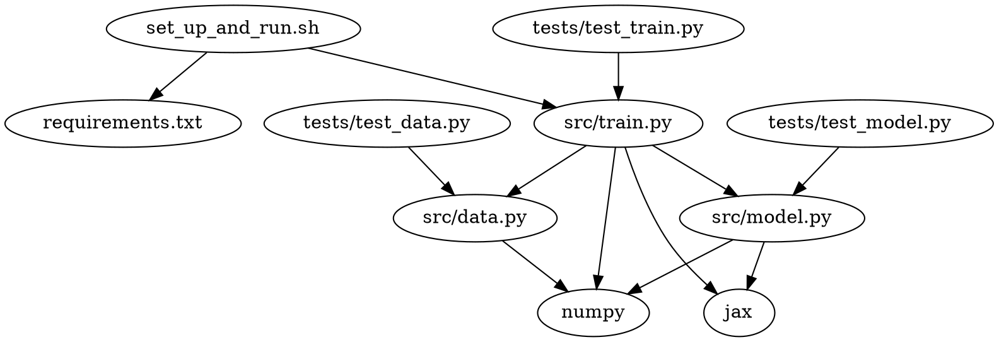

# Technical Specification: JAX IRIS Classifier

## Table of Contents
1. [Last Updated](#last-updated)
2. [Objectives](#objectives)
3. [Setup and Usage Instructions](#setup-and-usage-instructions)
4. [High-level Overview](#high-level-overview)
5. [Code Organization](#code-organization)
6. [Dependency Diagram](#dependency-diagram)
7. [Logging](#logging)
8. [Individual File Contents](#individual-file-contents)

## Last Updated
2023-05-26

## Objectives
The objective of this project is to train and test a feed-forward neural network classifier built using JAX on the iris dataset. The classifier will be run as a bash script that sets up a virtual environment, installs necessary requirements, downloads the data, splits the data into train and test sets, trains the classifier, tests the classifier, and exits the virtual environment.

## Setup and Usage Instructions
The codebase's root folder is `generated_projects/jax_iris_classifier`. All commands will be run from this location.

## High-level Overview
The codebase is organized into a `src` module containing the main functionality, a `tests` directory for testing, and a few other files for setup and documentation. The main steps to achieve the project objectives are:

1. Run the `set_up_and_run.sh` bash script.
2. Create a Python virtual environment and install necessary requirements.
3. Download the iris dataset.
4. Split the dataset into training and testing sets.
5. Train the feed-forward neural network classifier using JAX.
6. Test the classifier on the test set.
7. Log the results and exit the virtual environment.

## Code Organization
```
generated_projects/jax_iris_classifier
├── src
│   ├── __init__.py
│   ├── data.py
│   ├── model.py
│   └── train.py
├── tests
│   ├── __init__.py
│   ├── test_data.py
│   ├── test_model.py
│   └── test_train.py
├── set_up_and_run.sh
├── requirements.txt
├── readme.md
└── LICENSE
```

## Dependency Diagram


## Logging
The built-in `logging` module will be used with module-level loggers formatted as `YYYY-MM-DD HH:MM:SS | LEVEL | MESSAGE` where the datetime is in UTC. Log all new occurrences of issues and actions taken by the bot at the `INFO` level.

## Individual File Contents

### set_up_and_run.sh
A bash script to set up the virtual environment, install requirements, download data, split data, train the classifier, test the classifier, and exit the virtual environment.
- No additional functions or classes.

### requirements.txt
A list of required Python packages for the project.

### LICENSE
The MIT license file for the project.

### readme.md
A markdown file containing an overview of the project, its objectives, and usage instructions.

### src/data.py
Handles downloading and splitting the iris dataset.
- `def download_iris_data() -> Tuple[np.ndarray, np.ndarray]:`
    - Downloads the iris dataset and returns the features and labels as numpy arrays.
    - Third-party Python packages: numpy
- `def split_data(features: np.ndarray, labels: np.ndarray) -> Tuple[np.ndarray, np.ndarray, np.ndarray, np.ndarray]:`
    - Splits the dataset into training and testing sets where the test set is the last 2 data points from each class. Returns the train_features, train_labels, test_features, and test_labels as numpy arrays.
    - Third-party Python packages: numpy

### src/model.py
Defines the feed-forward neural network classifier using JAX.
- `class IrisClassifier:`
    - `def __init__(self, learning_rate: float = 0.01):`
        - Initializes the classifier with the given learning rate.
    - `def build_network(self) -> None:`
        - Builds the neural network with 2 hidden layers, 16 neurons each, ReLU activation function, softmax activation function for the output layer, cross-entropy loss function, and Adam optimizer.
        - Third-party Python packages: jax, numpy
    - `def train(self, features: np.ndarray, labels: np.ndarray, epochs: int = 100) -> None:`
        - Trains the classifier on the given features and labels for the specified number of epochs. Logs the loss and accuracy of the network at the `INFO` level every 10 epochs.
        - Third-party Python packages: jax, numpy
    - `def test(self, features: np.ndarray, labels: np.ndarray) -> float:`
        - Tests the classifier on the given features and labels, and returns the accuracy. Logs the final accuracy of the classifier at the `INFO` level.
        - Third-party Python packages: jax, numpy

### src/train.py
Main script to download data, split data, train the classifier, and test the classifier.
- `def main() -> None:`
    - Downloads the iris dataset, splits it into training and testing sets, trains the classifier, tests the classifier, and logs the results.
    - Third-party Python packages: jax, numpy

### tests/__init__.py
An empty file to make the `tests` directory a Python package.

### tests/test_data.py
Tests for the `src/data.py` module.
- `def test_download_iris_data():`
    - Tests the `download_iris_data` function.
- `def test_split_data():`
    - Tests the `split_data` function.

### tests/test_model.py
Tests for the `src/model.py` module.
- `def test_iris_classifier():`
    - Tests the `IrisClassifier` class and its methods.

### tests/test_train.py
Tests for the `src/train.py` module.
- `def test_main():`
    - Tests the `main` function.
