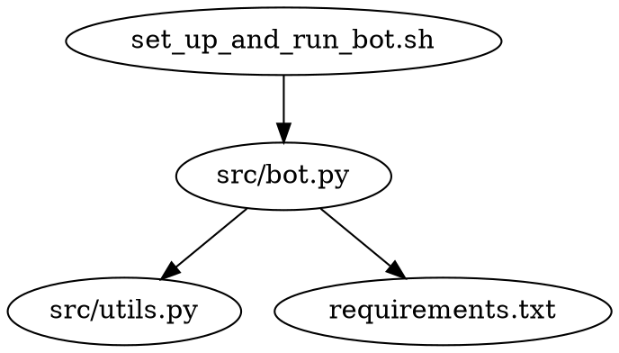

# Local Discord Bot

## Overview

The purpose of this project is to create a Discord bot that allows users to subscribe and have their messages' characters counted by the bot. The bot will reply with a dictionary containing a mapping of each character in the message to the number of times that character appeared in the message.

## Setup and Usage Instructions

1. Clone the repository.
2. Set the `DISCORD_TOKEN` environment variable with your Discord bot token.
3. Run the `set_up_and_run_bot.sh` script to set up the virtual environment, install the necessary requirements, and start the bot.

## Dependency Diagram



## File Structure

```
local_discord_bot
├── .venv
├── set_up_and_run_bot.sh
├── src
│   ├── bot.py
│   └── utils.py
├── requirements.txt
├── readme.md
└── LICENSE
```

## Logging

The built-in `logging` module is used with module-level loggers formatted as `YYYY-MM-DD HH:MM:SS | LEVEL | MESSAGE` where the datetime is in UTC. Log all messages received and sent by the bot at the `DEBUG` level and all actions taken by the bot at the `INFO` level.