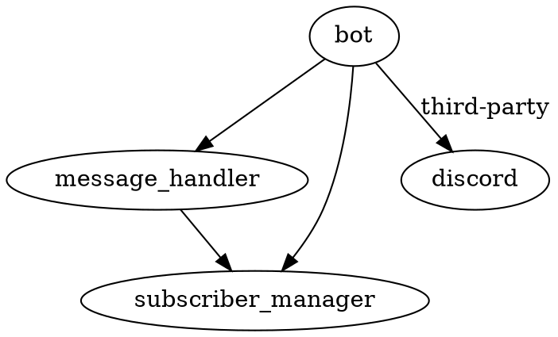

# Project Design Document

## Table of Contents

- [Last Updated](#last-updated)
- [Overview](#overview)
- [Setup and Usage Instructions](#setup-and-usage-instructions)
- [Dependency Diagram](#dependency-diagram)
- [File Structure](#file-structure)
- [Logging](#logging)
- [set_up_and_run_bot.sh](#set_up_and_run_botsh)
- [src/bot.py](#srcbotpy)
- [src/message_handler.py](#srcmessage_handlerpy)
- [src/subscriber_manager.py](#srcsubscriber_managerpy)
- [tests/test_bot.py](#teststest_botpy)
- [tests/test_message_handler.py](#teststest_message_handlerpy)
- [tests/test_subscriber_manager.py](#teststest_subscriber_managerpy)
- [requirements.txt](#requirementstxt)
- [readme.md](#readmemd)
- [LICENSE](#license)

## Last Updated

2023-05-25

## Overview

The purpose of this project is to create a Discord bot that allows users to send messages and have those messages' characters counted by the bot and sent back to the user as a reply to their message. The bot will also manage subscriptions and unsubscriptions of users.

## Setup and Usage Instructions

1. Clone the repository.
2. Set the `DISCORD_TOKEN` environment variable with your Discord bot token.
3. Run the `set_up_and_run_bot.sh` script to set up the virtual environment, install the required packages, and start the bot.

## Dependency Diagram



## File Structure

```
generated_projects/local_discord_bot
├── .venv
├── set_up_and_run_bot.sh
├── src
│   ├── bot.py
│   ├── message_handler.py
│   └── subscriber_manager.py
├── tests
│   ├── test_bot.py
│   ├── test_message_handler.py
│   └── test_subscriber_manager.py
├── requirements.txt
├── readme.md
└── LICENSE
```

## Logging

The built-in `logging` module will be used with module-level loggers formatted as `YYYY-MM-DD HH:MM:SS | LEVEL | MESSAGE` where the datetime is in UTC. Log all messages received and sent by the bot at the `DEBUG` level and all actions taken by the bot at the `INFO` level.

## set_up_and_run_bot.sh

Bash script to set up the virtual environment, install the required packages, and start the bot.

## src/bot.py

Main entry point for the Discord bot.

- Third-party packages: `discord`
- Environment variables: `DISCORD_TOKEN`

- `async def main() -> None`
  - Description: Starts the bot and connects it to Discord.
- `if __name__ == "__main__":`
  - Description: Calls the `main` function when the script is executed.

## src/message_handler.py

Handles incoming messages and processes them accordingly.

- Third-party packages: `discord`

- `class MessageHandler:`
  - Description: Class responsible for handling messages and processing them.

  - `async def handle_message(self, message: discord.Message) -> None`
    - Description: Processes an incoming message and takes appropriate action based on its content.
    - Example input-output pair: `message="bot I want to subscribe!"` -> bot subscribes the user and sends a confirmation message.

## src/subscriber_manager.py

Manages the list of subscribers and provides methods to add and remove subscribers.

- `class SubscriberManager:`
  - Description: Class responsible for managing the list of subscribers.

  - `def add_subscriber(self, user: str) -> None`
    - Description: Adds a user to the list of subscribers.
    - Example input-output pair: `user="JohnDoe#1234"` -> user is added to the list of subscribers.

  - `def remove_subscriber(self, user: str) -> None`
    - Description: Removes a user from the list of subscribers.
    - Example input-output pair: `user="JohnDoe#1234"` -> user is removed from the list of subscribers.

  - `def is_subscriber(self, user: str) -> bool`
    - Description: Checks if a user is a subscriber.
    - Example input-output pair: `user="JohnDoe#1234"` -> `True` if the user is a subscriber, `False` otherwise.

## tests/test_bot.py

Test cases for the `bot.py` module.

## tests/test_message_handler.py

Test cases for the `message_handler.py` module.

## tests/test_subscriber_manager.py

Test cases for the `subscriber_manager.py` module.

## requirements.txt

List of required Python packages for the project.

## readme.md

Documentation for the project, including setup and usage instructions.

## LICENSE

MIT License for the project.