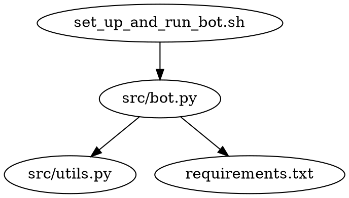

# Project Design Document

## Table of Contents

- [Last Updated](#last-updated)
- [Overview](#overview)
- [Setup and Usage Instructions](#setup-and-usage-instructions)
- [Dependency Diagram](#dependency-diagram)
- [File Structure](#file-structure)
- [Logging](#logging)
- [set_up_and_run_bot.sh](#set_up_and_run_botsh)
- [src/bot.py](#srcbotpy)
- [src/utils.py](#srcutilspy)
- [requirements.txt](#requirementstxt)
- [readme.md](#readmemd)
- [LICENSE](#license)

## Last Updated

2023-05-22

## Overview

The purpose of this project is to create a Discord bot that allows users to subscribe and have their messages' characters counted by the bot. The bot will reply with a dictionary containing a mapping of each character in the message to a count of the number of times that character appeared in the message.

## Setup and Usage Instructions

1. Clone the repository.
2. Ensure you have Python 3.8 or higher installed.
3. Set the `DISCORD_TOKEN` environment variable with your bot's token.
4. Run the `set_up_and_run_bot.sh` script to set up the virtual environment, install dependencies, and start the bot.

## Dependency Diagram



## File Structure

```
local_discord_bot
├── .venv
├── set_up_and_run_bot.sh
├── src
│   ├── bot.py
│   └── utils.py
├── requirements.txt
├── readme.md
└── LICENSE
```

## Logging

The built-in `logging` module will be used with module-level loggers formatted as `YYYY-MM-DD HH:MM:SS | LEVEL | MESSAGE` where the datetime is in UTC. Log all messages received and sent by the bot at the `DEBUG` level and all actions taken by the bot at the `INFO` level.

## set_up_and_run_bot.sh

A bash script that sets up the Python virtual environment, installs the necessary requirements, and starts the bot.

## src/bot.py

The main file for the Discord bot, handling user subscriptions, message processing, and bot replies.

- Third-party packages: `discord.py`
- Environment variables: `DISCORD_TOKEN`

- `class CharacterCountBot(discord.Client)`
  - Description: The main bot class, inheriting from `discord.Client`.
  - Methods:
    - `async def on_ready(self)`
      - Description: Called when the bot is ready, logs the bot's username and ID.
    - `async def on_message(self, message)`
      - Description: Called when a message is received, processes the message and replies accordingly.
      - Example input-output pair: `bot I want to subscribe!` -> `You have been subscribed {user}!`

## src/utils.py

Utility functions for the bot.

- `def count_characters(message: str) -> Dict[str, int]`
  - Description: Counts the occurrences of each character in the given message.
  - Example input-output pair: `"hello"` -> `{"h": 1, "e": 1, "l": 2, "o": 1}`

## requirements.txt

A list of required Python packages for the project.

## readme.md

A brief description of the project, its purpose, and setup instructions.

## LICENSE

The license file for the project.