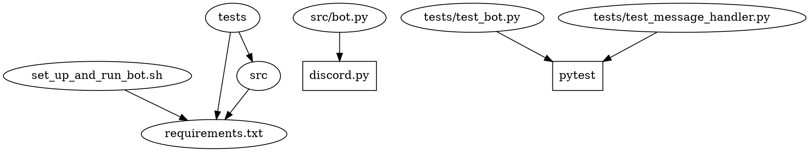

# Project Design Document

## Table of Contents

- [Last Updated](#last-updated)
- [Overview](#overview)
- [Setup and Usage Instructions](#setup-and-usage-instructions)
- [Dependency Diagram](#dependency-diagram)
- [File Structure](#file-structure)
- [Logging](#logging)
- [File Descriptions](#file-descriptions)

## Last Updated

2023-05-25

## Overview

The purpose of this project is to create a Discord bot that allows users to subscribe and have their messages' characters counted by the bot. The bot will reply with a dictionary containing a mapping of each character in the message to a count of the number of times that character appeared in the message.

## Setup and Usage Instructions

1. Clone the repository.
2. Set the `DISCORD_TOKEN` environment variable with your Discord bot token.
3. Run the `set_up_and_run_bot.sh` script to create a virtual environment, install the necessary requirements, and start the bot.

## Dependency Diagram



## File Structure

```
generated_projects/local_discord_bot
├── LICENSE
├── project_design_document.md
├── readme.md
├── requirements.txt
├── set_up_and_run_bot.sh
├── src
│   ├── __init__.py
│   ├── bot.py
│   └── message_handler.py
├── tests
│   ├── __init__.py
│   ├── test_bot.py
│   └── test_message_handler.py
└── .venv
```

## Logging

The built-in `logging` module will be used with module-level loggers formatted as `YYYY-MM-DD HH:MM:SS | LEVEL | MESSAGE` where the datetime is in UTC. Log all messages received and sent by the bot at the `DEBUG` level and all actions taken by the bot at the `INFO` level.

## File Descriptions

### readme.md
A brief description of the project and instructions on how to set up and use the Discord bot.
- No third-party Python packages.
- No environment variables.

### project_design_document.md
The design document for the project, detailing the project's purpose, setup instructions, dependencies, file structure, logging, and file descriptions.
- No third-party Python packages.
- No environment variables.

### set_up_and_run_bot.sh
A bash script that creates a Python virtual environment, installs the necessary requirements, and starts the bot.
- No third-party Python packages.
- No environment variables.

### requirements.txt
A list of required Python packages for the project.
- No third-party Python packages.
- No environment variables.

### LICENSE
The MIT License for the project.
- No third-party Python packages.
- No environment variables.

### src/bot.py
The main file for the Discord bot, responsible for connecting to Discord and handling events.
- Third-party Python packages: discord.py
- Environment variables: DISCORD_TOKEN
- `async def main() -> None`
  - The main function that connects the bot to Discord and runs it indefinitely.
- `async def on_ready() -> None`
  - Event handler for when the bot is connected and ready to receive messages. Configures logging and sets intents.message_content to True.
- `async def on_message(message: discord.Message) -> None`
  - Event handler for when a message is received by the bot. Processes subscribe and unsubscribe messages, and replies with character counts for subscribed users' messages.

### src/message_handler.py
Handles message processing, including subscribing and unsubscribing users, and character counting.
- No third-party Python packages.
- No environment variables.
- `class MessageHandler`
  - `def __init__(self) -> None`
    - Initializes the MessageHandler instance.
  - `async def handle_message(self, message: discord.Message) -> discord.Message`
    - Processes the message, handles subscribe and unsubscribe messages, and returns an appropriate response as a reply to the user's original message.
  - `def subscribe_user(self, user: str) -> None`
    - Adds a user to the list of subscribers.
  - `def unsubscribe_user(self, user: str) -> None`
    - Removes a user from the list of subscribers.
  - `def count_characters(self, message: str) -> Dict[str, int]`
    - Counts the characters in a message and returns a dictionary mapping characters to their counts.

### tests/test_bot.py
Test file for the bot.py module.
- Third-party Python packages: pytest, discord.py
- No environment variables.

### tests/test_message_handler.py
Test file for the message_handler.py module.
- Third-party Python packages: pytest
- No environment variables.