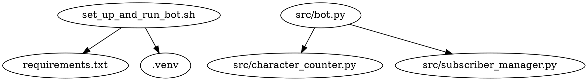

# Project Design Document

## Table of Contents

- [Last Updated](#last-updated)
- [Overview](#overview)
- [Setup and Usage Instructions](#setup-and-usage-instructions)
- [Dependency Diagram](#dependency-diagram)
- [File Structure](#file-structure)
- [File Descriptions](#file-descriptions)

## Last Updated

2023-05-21

## Overview

The purpose of this project is to create a Discord bot that allows users to subscribe and have their messages character-counted by the bot. The bot will reply to the user's message with a dictionary containing a mapping of each character in the message to a count of the number of times that character appeared in the message.

## Setup and Usage Instructions

1. Clone the repository.
2. Set the `DISCORD_TOKEN` environment variable with your Discord bot token.
3. Run the `set_up_and_run_bot.sh` script to create a virtual environment, install the necessary requirements, and start the bot.

## Dependency Diagram



## File Structure

```
local_discord_bot
├── .venv
├── generated_projects
│   └── local_discord_bot
│       └── project_design_document.md
├── LICENSE
├── readme.md
├── requirements.txt
├── set_up_and_run_bot.sh
└── src
    ├── bot.py
    ├── character_counter.py
    └── subscriber_manager.py
```

## File Descriptions

### set_up_and_run_bot.sh
A bash script that sets up a Python virtual environment, installs the necessary requirements, and starts the Discord bot.
- Environment Variables:
  - `DISCORD_TOKEN`: The Discord bot token.

### requirements.txt
A list of required Python packages for the project.

### src/bot.py
The main entry point for the Discord bot, responsible for handling user messages and managing subscriptions.
- Third-party Python packages:
  - discord.py
- Environment Variables:
  - `DISCORD_TOKEN`: The Discord bot token.
- Functions and Classes:
  - `on_ready()`: Logs when the bot is ready and connected to Discord.
  - `on_message(message)`: Handles incoming messages, subscribing/unsubscribing users, and replying with character counts.

### src/character_counter.py
A module that provides a function to count the characters in a given message.
- Functions:
  - `count_characters(message: str) -> Dict[str, int]`: Counts the characters in the given message and returns a dictionary mapping characters to their counts.
    - Example Input: "hello"
    - Example Output: {"h": 1, "e": 1, "l": 2, "o": 1}

### src/subscriber_manager.py
A module that manages the list of subscribers for the Discord bot.
- Classes:
  - `SubscriberManager`
    - Methods:
      - `add_subscriber(user: str)`: Adds a user to the list of subscribers.
      - `remove_subscriber(user: str)`: Removes a user from the list of subscribers.
      - `is_subscribed(user: str) -> bool`: Checks if a user is subscribed.
        - Example Input: "user#1234"
        - Example Output: True