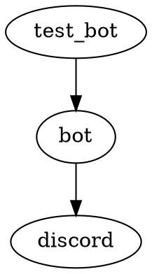

# Project Design Document

## Table of Contents

- [Last Updated](#last-updated)
- [Overview](#overview)
- [Setup and Usage Instructions](#setup-and-usage-instructions)
- [Dependency Diagram](#dependency-diagram)
- [File Structure](#file-structure)
- [Logging](#logging)
- [set_up_and_run_bot.sh](#set_up_and_run_botsh)
- [requirements.txt](#requirementstxt)
- [LICENSE](#license)
- [readme.md](#readmemd)
- [src/bot.py](#srcbotpy)
- [tests/test_bot.py](#teststest_botpy)

## Last Updated

2023-05-24

## Overview

The purpose of this project is to create a Discord bot that allows users to subscribe and have their messages' characters counted by the bot. The bot will reply with a dictionary containing a mapping of each character in the message to a count of the number of times that character appeared in the message.

## Setup and Usage Instructions

1. Clone the repository.
2. Set the `DISCORD_TOKEN` environment variable with your Discord bot token.
3. Run the `set_up_and_run_bot.sh` script to set up the virtual environment, install the required packages, and start the bot.

## Dependency Diagram



## File Structure

```
local_discord_bot
├── .venv
├── LICENSE
├── readme.md
├── requirements.txt
├── set_up_and_run_bot.sh
├── src
│   └── bot.py
└── tests
    └── test_bot.py
```

## Logging

The built-in `logging` module will be used with module-level loggers formatted as `YYYY-MM-DD HH:MM:SS | LEVEL | MESSAGE` where the datetime is in UTC. Log all messages received and sent by the bot at the `DEBUG` level and all actions taken by the bot at the `INFO` level (such as subscribing users or unsubscribing users).

## set_up_and_run_bot.sh

A bash script that sets up the virtual environment, installs the required packages, and starts the bot. The script will create a virtual environment at `<project_root>/.venv`, install the necessary requirements into the virtual environment, and start the bot from inside the virtual environment.

## requirements.txt

A list of required Python packages for the project. The file will include the `discord.py` package and any other necessary packages.

## LICENSE

The MIT License for the project.

## readme.md

A brief description of the project and instructions on how to set up and use the bot. The file will include an overview of the bot's functionality, setup instructions, and usage instructions.

## src/bot.py

The main file containing the Discord bot implementation.

- Third-party packages: `discord.py`
- Environment variables: `DISCORD_TOKEN`

- `class CharacterCountBot(discord.Client)`
  - A subclass of `discord.Client` that implements the character counting bot.
  - `intents.message_content = True`
  - `async def on_ready(self)`
    - Logs when the bot is ready and connected to Discord.
  - `async def on_message(self, message: discord.Message)`
    - Handles incoming messages, subscribing and unsubscribing users, and replying with character counts.
    - Example input-output pair: `message: "Hello, world!"` -> `reply: "{'H': 1, 'e': 1, 'l': 3, 'o': 2, ',': 1, ' ': 1, 'w': 1, 'r': 1, 'd': 1, '!': 1}"`
  - `async def subscribe_user(self, user: discord.User)`
    - Subscribes a user to the bot and sends a confirmation message.
  - `async def unsubscribe_user(self, user: discord.User)`
    - Unsubscribes a user from the bot and sends a confirmation message.

## tests/test_bot.py

Test cases for the `bot.py` file.

- Third-party packages: `pytest`
- `def test_character_count()`
  - Tests the character counting functionality of the bot.
- `def test_subscribe_user()`
  - Tests the user subscription functionality of the bot.
- `def test_unsubscribe_user()`
  - Tests the user unsubscription functionality of the bot.