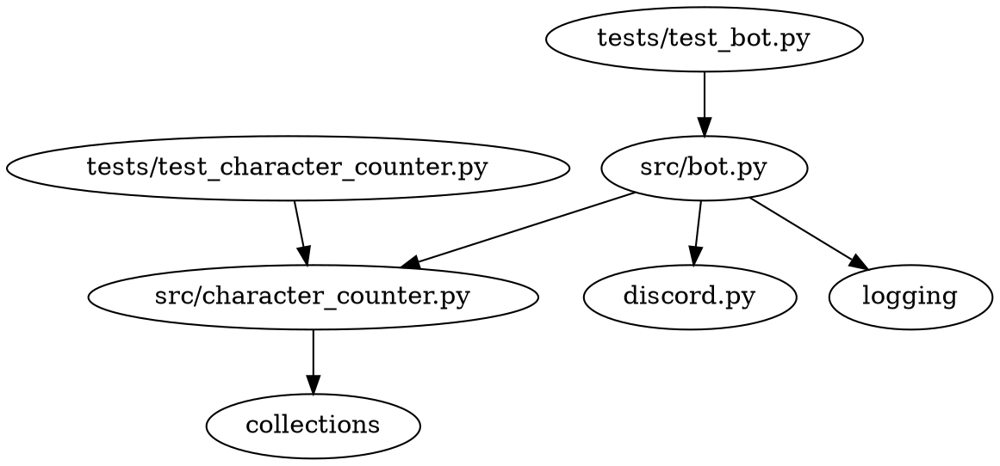

# Project Design Document

## Table of Contents

1. [Last Updated](#last-updated)
2. [Overview](#overview)
3. [Setup and Usage Instructions](#setup-and-usage-instructions)
4. [Code Organization](#code-organization)
5. [Dependency Diagram](#dependency-diagram)
6. [Logging](#logging)
7. [Individual File Contents](#individual-file-contents)

## Last Updated

2023-05-26

## Overview

This project aims to create a Discord bot that allows users to subscribe and receive character count statistics for their messages. The bot will listen for messages from its subscribers and respond with a dictionary containing a mapping of each character in the message to a count of the number of times that character appeared in the message.

## Setup and Usage Instructions

The codebase's root folder is `generated_projects/local_discord_bot`. All commands will be run from this location.

To set up and run the bot, execute the following bash script:

```bash
./set_up_and_run_bot.sh
```

## Code Organization

```
generated_projects/local_discord_bot
├── src
│   ├── __init__.py
│   ├── bot.py
│   └── character_counter.py
├── tests
│   ├── test_bot.py
│   └── test_character_counter.py
├── set_up_and_run_bot.sh
├── requirements.txt
├── LICENSE
├── readme.md
└── project_design_document.md
```

## Dependency Diagram



## Logging

The built-in `logging` module will be used with module-level loggers formatted as `YYYY-MM-DD HH:MM:SS | LEVEL | MESSAGE` where the datetime is in UTC. Log all messages received and sent by the bot at the `DEBUG` level and log all actions taken by the bot at the `INFO` level (such as subscribing users or unsubscribing users).

## Individual File Contents

### set_up_and_run_bot.sh

This bash script sets up the virtual environment, installs the required packages, runs the tests, and starts the bot.

### requirements.txt

This file lists the required Python packages for the project.

- discord.py

### LICENSE

This file contains the MIT license for the project.

### readme.md

This file provides an overview of the project, setup and usage instructions, and any additional information relevant to users and developers.

### src/__init__.py

This file allows the `src` directory to be treated as a Python package.

### src/bot.py

This file contains the main Discord bot logic.

- `class DiscordBot(discord.Client)`
    - `def __init__(self) -> None`
        - Description: Initializes the DiscordBot class with an empty set of subscribers.
    - `async def on_ready(self) -> None`
        - Description: Called when the bot is ready and connected to Discord.
    - `async def on_message(self, message: discord.Message) -> None`
        - Description: Called when a message is received. Handles subscribing, unsubscribing, and character counting for subscribers.
        - Example input-output pair: `message="bot I want to subscribe!"` -> bot replies with "You have been subscribed {user}!"
    - `def subscribe_user(self, user: str) -> None`
        - Description: Adds the user to the bot's subscribers.
    - `def unsubscribe_user(self, user: str) -> None`
        - Description: Removes the user from the bot's subscribers.
    - `def run_bot(token: str) -> None`
        - Description: Starts the bot with the given token and sets `intents.message_content = True`.
        - Environment variables: `DISCORD_TOKEN`

### src/character_counter.py

This file contains the character counting logic.

- `def count_characters(text: str) -> Dict[str, int]`
    - Description: Counts the occurrences of each character in the given text and returns a dictionary with the character as the key and the count as the value.
    - Example input-output pair: `text="hello"` -> `{'h': 1, 'e': 1, 'l': 2, 'o': 1}`
    - Third-party Python packages: `collections`

### tests/test_bot.py

This file contains the tests for the `src/bot.py` file.

- `def test_on_message() -> None`
    - Description: Tests the `on_message` method of the `DiscordBot` class.
- `def test_subscribe_user() -> None`
    - Description: Tests the `subscribe_user` method of the `DiscordBot` class.
- `def test_unsubscribe_user() -> None`
    - Description: Tests the `unsubscribe_user` method of the `DiscordBot` class.

### tests/test_character_counter.py

This file contains the tests for the `src/character_counter.py` file.

- `def test_count_characters() -> None`
    - Description: Tests the `count_characters` function with various input strings.
