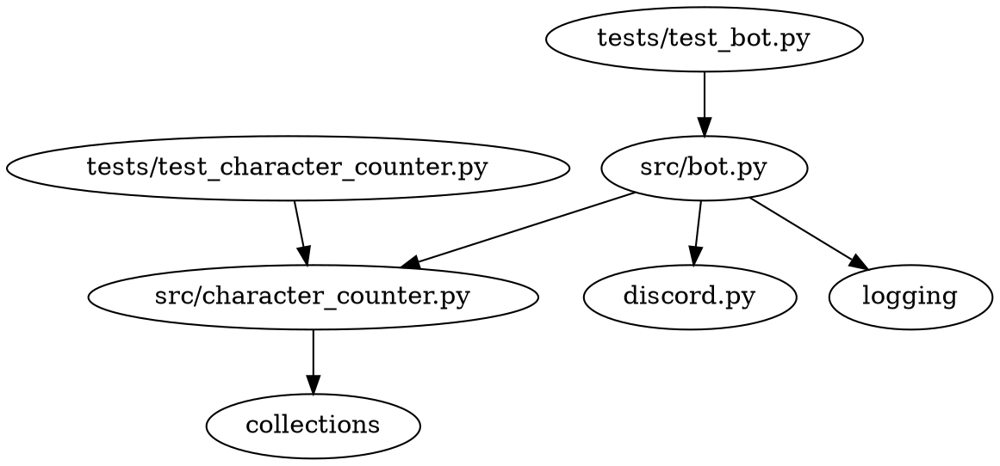

# Local Discord Bot

This is a Discord bot that allows users to subscribe and receive character count statistics for their messages. The bot will listen for messages from its subscribers and respond with a dictionary containing a mapping of each character in the message to a count of the number of times that character appeared in the message.

## Setup and Usage Instructions

The codebase's root folder is `generated_projects/local_discord_bot`. All commands will be run from this location.

To set up and run the bot, execute the following bash script:

```bash
./set_up_and_run_bot.sh
```

## Code Organization

```
generated_projects/local_discord_bot
├── src
│   ├── __init__.py
│   ├── bot.py
│   └── character_counter.py
├── tests
│   ├── test_bot.py
│   └── test_character_counter.py
├── set_up_and_run_bot.sh
├── requirements.txt
├── LICENSE
├── readme.md
└── project_design_document.md
```

## Dependency Diagram



## Logging

The built-in `logging` module will be used with module-level loggers formatted as `YYYY-MM-DD HH:MM:SS | LEVEL | MESSAGE` where the datetime is in UTC. Log all messages received and sent by the bot at the `DEBUG` level and log all actions taken by the bot at the `INFO` level (such as subscribing users or unsubscribing users).

## Contributing

If you would like to contribute to this project, please feel free to submit a pull request or open an issue on the project's repository.

## Authors

- AI Software Engineer

## License

This project is licensed under the MIT License. See the [LICENSE](LICENSE) file for details.
