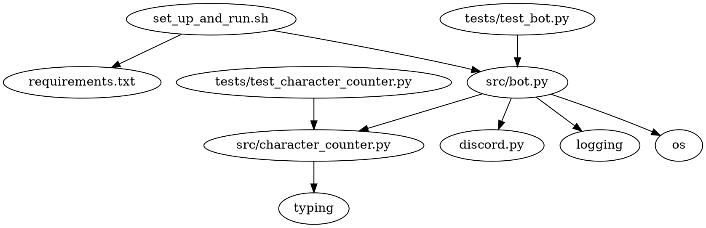

# Technical Specification: Discord Bot Deployed Run Locally

## Table of Contents

1. [Last Updated](#last-updated)
2. [Project Objectives](#project-objectives)
3. [Setup and Usage Instructions](#setup-and-usage-instructions)
4. [High-Level Overview of the Codebase](#high-level-overview-of-the-codebase)
5. [Code Organization](#code-organization)
6. [Dependency Diagram](#dependency-diagram)
7. [Logging](#logging)
8. [Individual File Contents](#individual-file-contents)

## Last Updated

2023-05-26

## Project Objectives

The objective of this project is to create a Discord bot that allows users to subscribe and receive character count statistics for their messages. The bot will listen for messages from its subscribers and respond with a dictionary containing a mapping of each character in the message to a count of the number of times that character appeared in the message.

## Setup and Usage Instructions

All commands will be run from the codebase's root folder: `generated_projects/local_discord_bot`.

1. Run the bash script `set_up_and_run.sh` to create a Python virtual environment, install the necessary requirements, and start the bot.
2. The bot will run indefinitely until it is stopped manually.

## High-Level Overview of the Codebase

The codebase is organized into a `src` module containing the main bot functionality and a `tests` directory containing test files for each Python file in the `src` module. The bot is started by running the `set_up_and_run.sh` bash script, which sets up the virtual environment, installs the required packages, and starts the bot.

The bot achieves its objectives by:

1. Listening for messages from users.
2. Subscribing or unsubscribing users based on their messages.
3. Responding with character count statistics for messages from subscribed users.

## Code Organization

```
generated_projects/
└── local_discord_bot/
    ├── src/
    │   ├── __init__.py
    │   ├── bot.py
    │   └── character_counter.py
    ├── tests/
    │   ├── test_bot.py
    │   └── test_character_counter.py
    ├── set_up_and_run.sh
    ├── requirements.txt
    ├── readme.md
    └── LICENSE
```

## Dependency Diagram



## Logging

The built-in `logging` module will be used with module-level loggers formatted as `YYYY-MM-DD HH:MM:SS | LEVEL | MESSAGE` where the datetime is in UTC. Log all messages received and sent by the bot at the `DEBUG` level and all actions taken by the bot at the `INFO` level (such as subscribing users or unsubscribing users).

## Individual File Contents

### set_up_and_run.sh

This bash script sets up the virtual environment, installs the required packages, runs the tests, and starts the bot.

- No functions or classes are required for this file.

### requirements.txt

This file lists the required Python packages for the project.

- discord.py

### src/__init__.py

This file is an empty file that allows the `src` directory to be treated as a Python module.

### src/bot.py

This file contains the main bot functionality, including subscribing and unsubscribing users and responding with character count statistics.

- `class DiscordBot(discord.Client)`
  - `async def on_ready(self) -> None`
  - `async def on_message(self, message: discord.Message) -> None`
  - `def subscribe_user(self, user: str) -> None`
  - `def unsubscribe_user(self, user: str) -> None`
  - `def is_subscribed(self, user: str) -> bool`
- `def main() -> None`
- `if __name__ == "__main__":`
  - `main()`

Third-party Python packages used in this file:
- discord.py
- logging
- os

Add the following to the `src/bot.py` file:

- Configure the bot's intents with `intents.message_content = True`.
- Configure the logging settings for the bot.

Example input-output pairs:

- `subscribe_user`: Input: `"JohnDoe#1234"`, Output: User is added to the subscribers list.
- `unsubscribe_user`: Input: `"JohnDoe#1234"`, Output: User is removed from the subscribers list.
- `is_subscribed`: Input: `"JohnDoe#1234"`, Output: `True` if the user is subscribed, `False` otherwise.

### src/character_counter.py

This file contains the character counting functionality.

- `def count_characters(message: str) -> Dict[str, int]`

Third-party Python packages used in this file:
- typing

Example input-output pair:

- `count_characters`: Input: `"hello"`, Output: `{"h": 1, "e": 1, "l": 2, "o": 1}`

### tests/test_bot.py

This file contains tests for the `src/bot.py` file.

- `def test_subscribe_user()`
- `def test_unsubscribe_user()`
- `def test_is_subscribed()`

Third-party Python packages used in this file:
- discord.py

### tests/test_character_counter.py

This file contains tests for the `src/character_counter.py` file.

- `def test_count_characters()`

Third-party Python packages used in this file:
- typing

### readme.md

This file contains a brief description of the project and setup instructions.

### LICENSE

This file contains the MIT license for the project.
