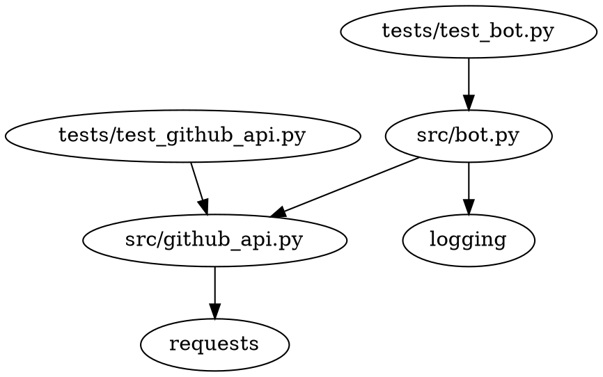

# Technical Specification: GitHub Issues to PR Bot

- Table of Contents
  - [Last Updated](#last-updated)
  - [Objectives](#objectives)
  - [Setup and Usage Instructions](#setup-and-usage-instructions)
  - [High-Level Overview](#high-level-overview)
  - [Code Organization](#code-organization)
  - [Dependency Diagram](#dependency-diagram)
  - [Logging](#logging)
  - [Individual File Contents](#individual-file-contents)

## Last Updated

2023-05-26

## Objectives

The objective of this project is to create a GitHub bot that monitors a specific repository for new issues, automatically creates a pull request for each issue, and closes the issue when the pull request is merged. The bot should run indefinitely and check for changes every 10 seconds.

## Setup and Usage Instructions

All commands should be run from the root folder of the codebase: `generated_projects/github_issues_to_pr_bot`.

1. Run the bash script `set_up_and_run.sh` to create a Python virtual environment, install necessary requirements, run tests, and start the bot.

## High-Level Overview

The codebase is organized into a `src` module containing the main functionality of the bot, and a `tests` directory containing test files for each Python file in the `src` module. The bot is started by running the `set_up_and_run.sh` script, which sets up the virtual environment, installs requirements, runs tests, and starts the bot.

The bot achieves its objectives by:

1. Monitoring the specified GitHub repository for new issues.
2. Creating a new branch and pull request for each new issue.
3. Closing the issue and adding a comment with a link to the pull request when the pull request is merged.
4. Handling existing open issues when the bot starts.

## Code Organization

```
generated_projects/github_issues_to_pr_bot
├── src
│   ├── __init__.py
│   ├── bot.py
│   └── github_api.py
├── tests
│   ├── __init__.py
│   ├── test_bot.py
│   └── test_github_api.py
├── set_up_and_run.sh
├── requirements.txt
├── LICENSE
├── readme.md
└── project_tech_spec.md
```

## Dependency Diagram



## Logging

The built-in `logging` module will be used with module-level loggers formatted as `YYYY-MM-DD HH:MM:SS | LEVEL | MESSAGE` where the datetime is in UTC. Log all new occurrences of issues and actions taken by the bot at the `INFO` level.

## Individual File Contents

### set_up_and_run.sh
This bash script sets up the virtual environment, installs requirements, runs tests, and starts the bot.
- No additional functions or classes are required for this file.

### src/bot.py
This file contains the main functionality of the bot, including monitoring the GitHub repository and creating pull requests for new issues.
- `def main() -> None:`
  - Description: The main function that starts the bot and runs it indefinitely.
  - Example input-output pair: N/A
  - Third-party Python packages: logging
  - Environment variables: TOKEN_FOR_GITHUB
- `def handle_existing_issues() -> None:`
  - Description: Handles existing open issues when the bot starts by creating pull requests for them.
  - Example input-output pair: N/A
  - Third-party Python packages: N/A
  - Environment variables: N/A

### src/github_api.py
This file contains functions for interacting with the GitHub API, such as creating branches, pull requests, and closing issues.
- `def create_branch(issue_number: int) -> None:`
  - Description: Creates a new branch with the issue number as the branch name.
  - Example input-output pair: N/A
  - Third-party Python packages: requests
  - Environment variables: TOKEN_FOR_GITHUB
- `def create_pull_request(issue_number: int, issue_title: str, issue_body: str) -> None:`
  - Description: Creates a pull request from the new branch to main with the issue's title, body, and a link to the issue.
  - Example input-output pair: N/A
  - Third-party Python packages: requests
  - Environment variables: TOKEN_FOR_GITHUB
- `def close_issue(issue_number: int, pull_request_url: str) -> None:`
  - Description: Adds a comment to the issue with a link to the pull request and closes the issue.
  - Example input-output pair: N/A
  - Third-party Python packages: requests
  - Environment variables: TOKEN_FOR_GITHUB

### tests/test_bot.py
This file contains tests for the `src/bot.py` file.
- `def test_main():`
  - Description: Tests the main function of the bot.
  - Example input-output pair: N/A
  - Third-party Python packages: N/A
  - Environment variables: N/A
- `def test_handle_existing_issues():`
  - Description: Tests the handle_existing_issues function.
  - Example input-output pair: N/A
  - Third-party Python packages: N/A
  - Environment variables: N/A

### tests/test_github_api.py
This file contains tests for the `src/github_api.py` file.
- `def test_create_branch():`
  - Description: Tests the create_branch function.
  - Example input-output pair: N/A
  - Third-party Python packages: N/A
  - Environment variables: N/A
- `def test_create_pull_request():`
  - Description: Tests the create_pull_request function.
  - Example input-output pair: N/A
  - Third-party Python packages: N/A
  - Environment variables: N/A
- `def test_close_issue():`
  - Description: Tests the close_issue function.
  - Example input-output pair: N/A
  - Third-party Python packages: N/A
  - Environment variables: N/A

